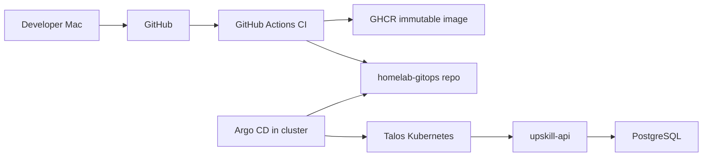

# Architecture

Rules:

- Kubernetes is not publicly exposed.
- GitHub Actions never deploys directly to Kubernetes.
- Argo CD pulls desired state from GitHub using outbound connectivity.
- The app repo owns code, tests, migrations, and Dockerfile.
- The GitOps repo owns Kustomize deployment state and environment promotion.
- Images are immutable and tagged as `sha-<git-sha>`.
- The same image tag is promoted across environments.
