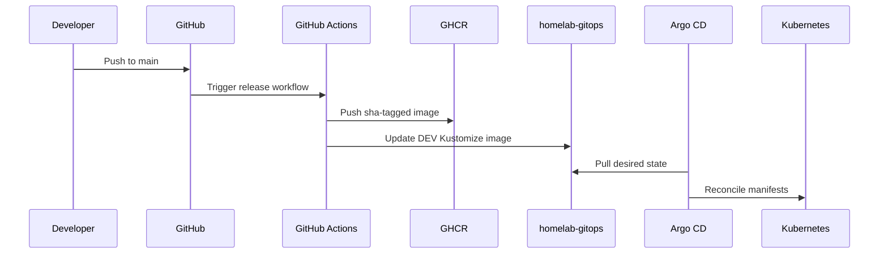

# Deployment

Deployment state lives in `homelab-gitops` and is rendered with Kustomize.

Flow:

DEV deploys automatically from `main`. STAGING and PROD promote the same image tag by editing the GitOps overlays. No rebuild occurs between environments.
